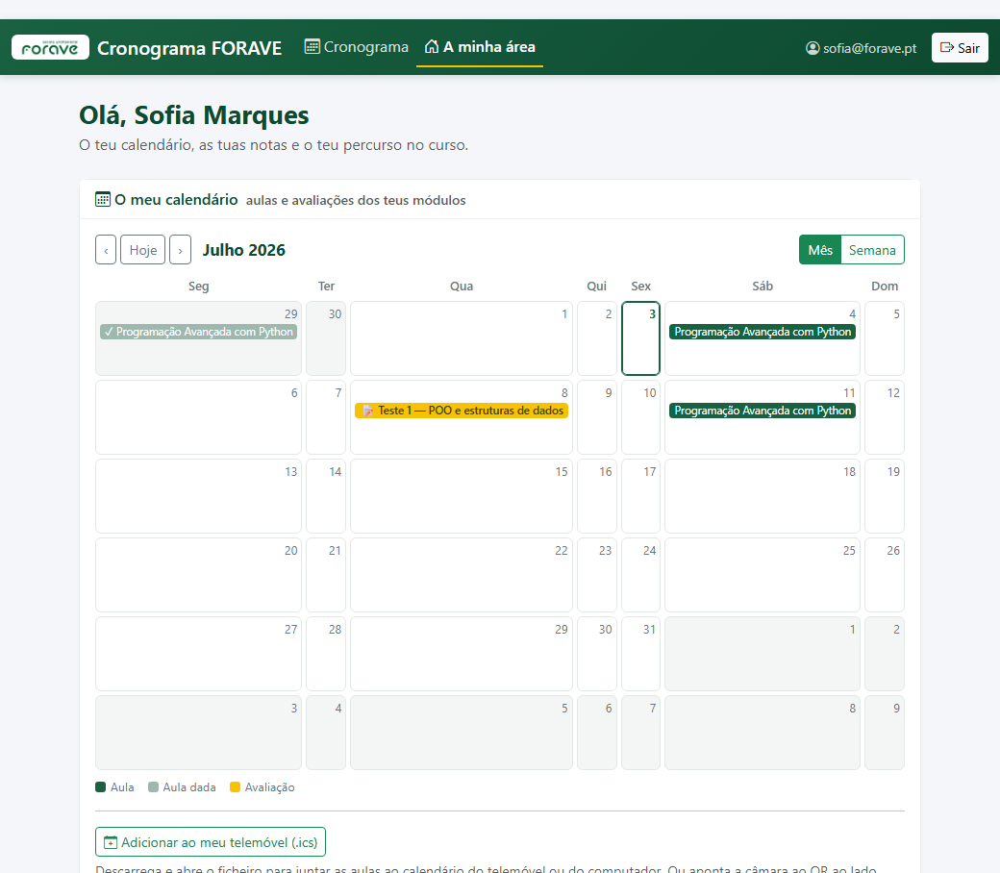

# Gestor de Cronograma — FORAVE

[](https://github.com/Andre-Learns-Data/cronograma-forave/actions/workflows/testes.yml)
[](https://cronograma-forave.onrender.com)

[](LICENSE)

Sistema de gestão do cronograma de um curso CET da FORAVE: módulos (UFCDs),
professores, formandos, alterações de horário, avaliações e **notas**. Resolve
um problema real da própria turma — manter o cronograma e as classificações
organizados e acessíveis.

O projeto começou como aplicação de **terminal** (Python puro + POO) e evoluiu
para um sistema com **dashboard web alojada na internet**, **área de aluno com
login** e **calendário visual**, mantendo sempre a mesma lógica Python no centro.

🌐 **Ver o sistema ao vivo:** **https://cronograma-forave.onrender.com**
&nbsp;·&nbsp; 📖 Guião de demonstração: **[DEMO.pdf](DEMO.pdf)**



> Estado atual: o site mostra dados de **exemplo** até serem carregados os dados
> reais da FORAVE (ver "Fluxo de utilização").

---

## ▶ Demonstração

Para ver o sistema a funcionar em poucos minutos:

1. Instalar as dependências: `pip install -r requirements.txt`
2. Carregar os dados de demonstração: `python seed_demo.py`
3. Arrancar a versão **web** (`python app.py` → <http://127.0.0.1:5000>) ou a de
   **terminal** (`python main.py`)
4. Iniciar sessão como coordenador: **`chronosforave@gmail.com`** / `demo1234`

**Guião passo a passo:** abrir **[`DEMO.pdf`](DEMO.pdf)** (ou [`DEMO.html`](DEMO.html)) —
percorre todas as funcionalidades pelos três perfis (coordenador, professor e
aluno), indicando a ação e o resultado esperado em cada passo.

---

## Arquitetura em duas metades

A regra do sistema é simples: **o coordenador escreve, a turma consulta.**

```
   COORDENADOR (escreve)                      TURMA (consulta)
   --------------------                       ----------------
   Terminal  (python main.py)                 Dashboard pública (web)
        |  cria módulos, lança notas,              ^  cronograma, progresso,
        |  importa CSV, etc.                       |  avaliações
        v                                          |
   JSON local (dados/)  ---- sincroniza ---->  Google Sheet (privado)
   (fonte de verdade)        (opção S)              |
                                                    v
                                          Dashboard alojada (Render)
                                          lê do Sheet + Área do aluno
                                          (login → vê só as suas notas)
```

- **Fonte de verdade:** ficheiros JSON locais (offline-first).
- **Cloud:** Google Sheet privado, espelho dos dados, lido pela dashboard alojada.
- **Página inicial pública (landing):** só boas-vindas + opções de entrada por
  perfil — **sem dados do curso** (RGPD). O cronograma (módulos, progresso,
  gráfico, PDF) fica em `/cronograma`, **atrás de login** (qualquer perfil).
- **Área do aluno (autenticada):** cada aluno vê só as suas notas (RGPD).
- **Área do coordenador (autenticada):** o coordenador também pode **escrever
  pela web** — gerir módulos/avaliações/notas e alterar o cronograma (avisando a
  turma). A escrita web grava de volta no Google Sheet de forma cirúrgica. Ou
  seja: a regra "o coordenador escreve" passou a ter **dois canais** (terminal e
  web), enquanto a turma continua só a consultar.

---

## Funcionalidades

**Domínio (terminal):**
- Gestão de módulos (com código UFCD), professores e formandos
- Registo de alterações ao cronograma + histórico
- Registo de horas lecionadas
- **Avaliações** por módulo (pontual/contínua/projeto) com peso
- **Notas** por instrumento + **nota final da UFCD** (média ponderada)
- Importação em massa por **CSV** (módulos/formandos/professores; os módulos
  aceitam uma coluna `datas` para carregar o cronograma de aulas)
- Remoção de formando (direito ao apagamento — RGPD)
- Notificações (consola / ficheiro / **email**)
- Geração de **QR code** para o endereço do site

**Cloud e Web:**
- Sincronização com **Google Sheets** (incluindo avaliações e notas)
- **Dashboard web (Flask)**: cartões de módulos, **gráfico de progresso dos
  módulos** (% concluído, os atrasados no topo), indicadores, exportação **PDF**
- **Calendário visual (mês/semana)** — feito de raiz, sem bibliotecas: o **aluno**
  vê as aulas e avaliações dos seus módulos; o **professor/coordenador** vê um
  *overview* dos módulos que gere. Com botão `.ics` + **QR** para o telemóvel
- **Login de aluno** (auto-registo validado contra a lista de formandos;
  passwords guardadas com *hash*, nunca em texto)
- **Recuperação de password** ("esqueci-me") por email, com token assinado e
  temporizado (*stateless*, de uso único — não guarda tokens em disco). Envio
  por **Brevo** (API de email transacional por HTTP) no alojamento — onde o
  envio direto por SMTP está bloqueado — com *fallback* para Gmail/SMTP local
- **Notificações por email** em três casos: **nota individual** ao aluno,
  **reagendamento** de aula à turma e **avaliação marcada/atualizada** à turma.
  Enviadas do remetente institucional, mas com **Reply-To** para quem fez a
  alteração (as respostas dos alunos vão ter com o professor/coordenador)
- **Controlo de horas por aula**: cada sessão do cronograma tem data, horas e
  marca de "dada"; as **horas dadas** (e as horas em falta) são **calculadas**
  automaticamente a partir das aulas marcadas
- **Área pessoal do aluno**: calendário, notas e nota final por UFCD
- **Área de administração (coordenador)**: ver todas as notas e gerir
  módulos, avaliações e notas **pela web**; **alterar datas do cronograma
  e avisar a turma por email**; acesso protegido por papel (autorização/RBAC
  — a lista de coordenadores vem de `COORDENADOR_EMAILS`)
- **Registo de auditoria (accountability)**: cada escrita da admin (módulo,
  avaliação, nota, alteração de cronograma) fica num histórico *append-only*
  com **quem, o quê e quando** — no caso das notas, guarda o valor lançado a
  cada aluno. Visível no painel do coordenador. Contrapeso ao RBAC tudo-ou-nada
- **Importar cronograma por CSV na web**: o coordenador faz *upload* de um CSV
  na área de admin e carrega vários módulos de uma vez (com as datas das aulas)
- **Editar módulos pela web**: além de criar, o coordenador edita um módulo
  existente (professor, UFCD, estado, horas e datas) directamente no painel
- **Autorização por papéis com âmbito**: **coordenador** gere tudo; **professor**
  entra e vê/gere **só o(s) seu(s) módulo(s)**; **aluno** vê só as suas notas —
  o papel é decidido pelo email no servidor
- **Exportar para o calendário (`.ics`) e por QR**: o cronograma completo e cada
  módulo geram um ficheiro iCalendar com as aulas — importável no Google
  Calendar/Outlook/telemóvel, com lembretes nativos, e acessível também por **QR
  code**. O horário é público; as notas nunca (só stdlib para o `.ics`)
- **PWA**: a dashboard é instalável no telemóvel (ícone, ecrã cheio, cache)
- **Alojamento** na internet (Render) — ver [DEPLOY.md](DEPLOY.md)

**Qualidade:**
- **Bateria de testes** automáticos (unittest) — pasta `testes/`

---

## Tecnologias

- **Python 3** (POO, dicionários, ficheiros, try/except)
- **Flask** + **gunicorn** (dashboard web / servidor de produção)
- **gspread** + **google-auth** (Google Sheets API)
- **werkzeug.security** (hash de passwords) + **itsdangerous** (tokens de
  reposição de password) — ambos vêm com o Flask
- **reportlab** (PDF), **qrcode** + **Pillow** (QR e ícones do PWA)
- **smtplib** / `email.mime` (email por SMTP, stdlib) e **Brevo** via
  `urllib` (email transacional por HTTP no alojamento, stdlib)
- **JSON** (stdlib) para persistência local

---

## Estrutura do projeto

```
cronograma-forave/
│
├── main.py                  ← App de terminal (coordenador) — python main.py
├── app.py                   ← Dashboard web (Flask) — python app.py
├── gestor_cronograma.py     ← Classe orquestradora (núcleo da lógica)
├── requirements.txt
│
├── seed_demo.py             ← Carrega dados de demonstração (python seed_demo.py)
├── DEMO.md / DEMO.html / DEMO.pdf   ← Guião de demonstração (3 formatos)
├── demo_*.csv               ← Dados de demo para importar (módulos/formandos/professores)
├── LICENSE                  ← Licença (MIT)
├── .github/workflows/       ← Integração contínua (corre os testes no GitHub)
│
├── classes/                 ← Domínio + integrações
│   ├── modulo.py            ← Modulo (+ avaliações, nota_final)
│   ├── professor.py / formando.py / alteracao.py / notificacao.py
│   ├── avaliacao_final.py   ← Avaliacao (+ notas por aluno)
│   ├── google_sheets.py     ← Sincronização e leitura do Google Sheets
│   ├── carregador_sheets.py ← Reconstrói o gestor a partir do Sheet (alojamento)
│   ├── email_sender.py      ← Envio de emails por SMTP (local)
│   ├── brevo_sender.py      ← Envio de emails por API HTTP (Brevo — alojamento)
│   ├── importador_csv.py    ← Importação em massa de CSV
│   ├── utilizador.py        ← Conta de acesso (email, hash, papel)
│   ├── autenticacao.py      ← Registo/login + reposição de password (hash;
│   │                          backend JSON ou Sheet)
│   ├── auditoria.py         ← RegistoAuditoria (quem/o quê/quando das escritas web)
│   ├── insights_engine.py   ← Indicadores do dashboard
│   ├── gerador_qr.py        ← Geração de QR codes
│   ├── gerador_ics.py       ← Exportação do cronograma para iCalendar (.ics)
│   └── utils.py             ← Funções de terminal (menus, inputs)
│
├── templates/               ← HTML da dashboard (Flask)
│   ├── landing.html         ← Página inicial pública (boas-vindas + entrar por perfil)
│   ├── dashboard.html       ← Cronograma (/cronograma) — só autenticado
│   ├── login.html / registar.html / aluno.html  ← Login + área do aluno
│   ├── recuperar.html / repor.html              ← Recuperação de password
│   └── admin.html           ← Gestão (coordenador vê tudo / professor só o seu módulo)
│
├── static/                  ← PWA: manifest.json, sw.js, ícones
│
├── testes/                  ← Bateria de testes (unittest)
│
├── DEPLOY.md                ← Guia de alojamento no Render
├── Procfile / runtime.txt / render.yaml   ← Configuração de deploy
│
├── .env.example             ← Template de configuração
├── .env                     ← Credenciais reais (NÃO vai para o GitHub)
├── credentials.json         ← Credenciais Google (NÃO vai para o GitHub)
└── dados/                   ← JSON locais (NÃO vão para o GitHub — RGPD)
```

---

## Como executar localmente

### 1. Instalar dependências
```bash
pip install -r requirements.txt
```

### 2. Configurar credenciais (opcional — o programa funciona sem elas)
Copiar `.env.example` para `.env` e preencher (ver "Configuração").

### 3a. App de terminal (coordenador)
```bash
python main.py
```

### 3b. Dashboard web (no teu PC)
```bash
python app.py
```
Depois abrir `http://127.0.0.1:5000`.

> No Windows, se vires um erro de codificação (`UnicodeEncodeError`) ao sincronizar,
> corre antes `set PYTHONIOENCODING=utf-8`.

---

## Menu do terminal

```text
 1. Ver cronograma (módulos)        8. Ver histórico de alterações
 2. Adicionar módulo                9. Registar horas lecionadas
 3. Ver professores               10. Importar dados CSV
 4. Adicionar professor           11. Adicionar avaliação a um módulo
 5. Ver formandos                 12. Remover formando (RGPD)
 6. Adicionar formando            13. Lançar notas de avaliação
 7. Registar alteração            14. Gerar QR code da página/dashboard

 S. Sincronizar com Google Sheets   0. Sair
```

---

## Fluxo de utilização (com dados reais)

1. Coordenador corre `python main.py`, adiciona/importa módulos, professores e
   formandos, lança avaliações e notas.
2. Opção **S (Sincronizar)** → envia tudo para o Google Sheet privado.
3. A dashboard alojada (no Render) passa a mostrar os dados reais.
4. Cada aluno vai ao site, **regista-se** com o seu email (que tem de estar na
   lista de formandos) e **entra** para ver as suas notas.

> ⚠️ **RGPD:** ao sincronizar dados com nomes de alunos, o dashboard público
> pode mostrá-los — obter consentimento da turma antes. As **notas** são sempre
> privadas (só o aluno autenticado vê as suas).

---

## Alojamento (deploy)

A dashboard está alojada no **Render** (plano gratuito), a ler do Google Sheet.
O passo-a-passo completo está em **[DEPLOY.md](DEPLOY.md)**.

---

## Testes

```bash
python -m unittest discover -s testes -p "test_*.py"
```
São **138 testes** (unittest) que cobrem o domínio, o gestor, a importação CSV, a
autenticação, a sincronização com o Sheet e as rotas web (incluindo o isolamento
RGPD entre alunos e o registo de auditoria da área de admin). Correm
automaticamente no GitHub a cada *push* (ver `.github/workflows/`).

---

## Configuração (`.env`)

```env
EMAIL_REMETENTE=             # remetente dos emails (Gmail local / verificado no Brevo)
EMAIL_PASSWORD=              # App Password do Gmail (envio por SMTP, local)
EMAIL_SERVIDOR=              # opcional (por defeito smtp.gmail.com)
EMAIL_PORTA=587             # opcional

BREVO_API_KEY=              # chave do Brevo (envio por HTTP no alojamento)

COORDENADOR_EMAILS=         # emails de coordenador (separados por vírgula)

GOOGLE_SHEETS_NOME=          # ID da spreadsheet
GOOGLE_SHEETS_CREDENCIAIS=   # caminho do credentials.json
```

No alojamento (Render), estas variáveis (mais `FONTE_DADOS=sheets` e
`FLASK_SECRET_KEY`) são definidas como variáveis de ambiente, e o
`credentials.json` é carregado como *Secret File* — nunca no GitHub. Para o
envio de email no Render usa-se o **`BREVO_API_KEY`** (o Gmail/SMTP só funciona
localmente — o Render bloqueia o SMTP). Ver [DEPLOY.md](DEPLOY.md).

---

## Conceitos aplicados

POO; dicionários e listas; ficheiros e JSON; try/except; modularização
multi-ficheiro; integração com APIs; aplicação de terminal **e** web;
autenticação e *hashing* de passwords; **autorização por papéis (RBAC)**;
**registo de auditoria (accountability)** das escritas web; **reposição de
password com tokens assinados**; **email transacional por HTTP** (contornar o
bloqueio de SMTP na cloud); deploy na cloud; testes automáticos.

---

## Autores

- André Moreira
- Juliana Nunes
- Marcelo Orso
